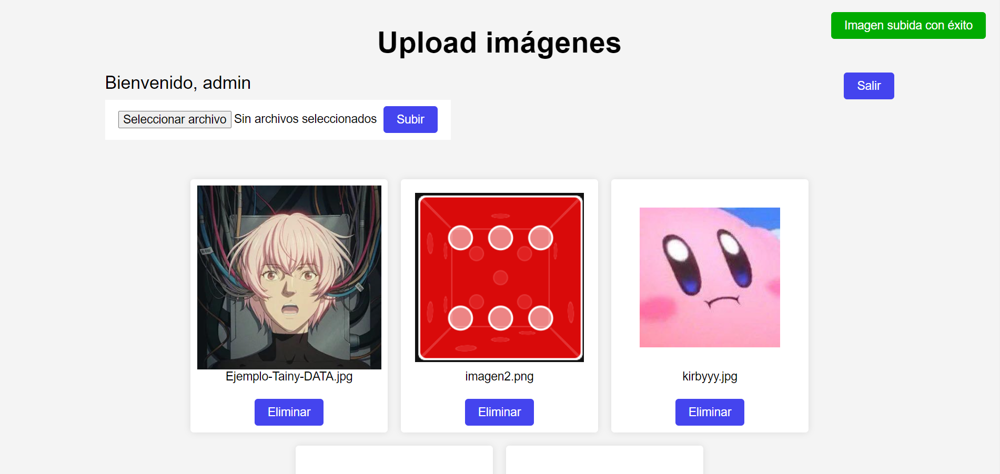

# PHP Images Upload

## Descripción
Practica de simulación de subida de imágenes a un servidor con PHP, usando HTML, CSS y JavaScript para dinamizar la interfaz.

## ¿Cómo usar?
Puedes iniciar el proyecto con un servidor local, una vez dentro el usuario de ejemplo es `admin` y la contraseña es `1234`.
